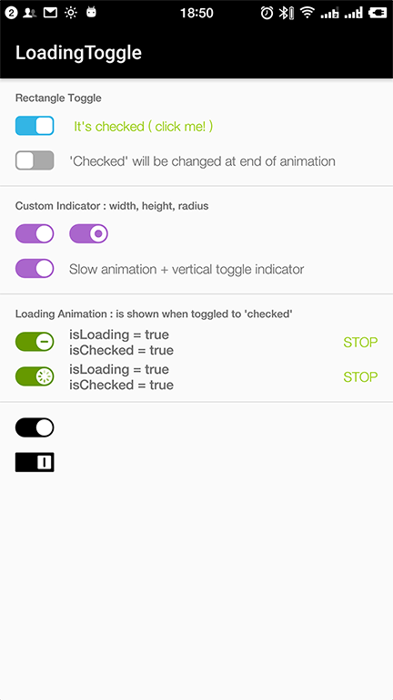

# LoadingToggleButton
LoadingToggleButton is a toggle button shows loading animation when toggled, from 'checked' to 'unchecked', or from 'unchecked' to 'checked'.

| Design                                  | Screenshot               |
| --------------------------------------- | ------------------------ |
|  |  |

# Install

LoadingToggleButton is available on [JitPack](https://jitpack.io/#intret/LoadingToggleButton).

[](https://jitpack.io/#intret/LoadingToggleButton)

**Step 1.** Add the JitPack repository to your build file

Add it in your root build.gradle at the end of repositories:

```groovy
    allprojects {
		repositories {
			...
			maven { url 'https://jitpack.io' }
		}
	}
```

**Step 2.** Add the dependency

```groovy
    dependencies {
	        compile 'com.github.intret:LoadingToggleButton:master-SNAPSHOT'
	}
```

See detailed available versions at https://jitpack.io/#intret/LoadingToggleButton

## Usage

**Add toggle button to .xml layout file:**

```xml
<?xml version="1.0" encoding="utf-8"?>
<android.support.constraint.ConstraintLayout
    xmlns:android="http://schemas.android.com/apk/res/android"
    xmlns:app="http://schemas.android.com/apk/res-auto"
    xmlns:tools="http://schemas.android.com/tools"
    android:layout_width="match_parent"
    android:layout_height="match_parent"
    tools:context="cn.intret.lab.loadingtogglebuttondemo.MainActivity">


    <cn.intret.lab.library.LoadingToggleButton
        android:layout_width="wrap_content"
        android:layout_height="wrap_content"
        app:layout_constraintLeft_toLeftOf="parent"
        app:layout_constraintRight_toRightOf="parent"
        app:layout_constraintTop_toTopOf="parent"
        android:layout_marginTop="16dp"
        app:ltbToggleChecked="true"
        app:ltbBackgroundCheckedColor="@android:color/black"
        app:ltbBackgroundUncheckedColor="@android:color/darker_gray"
        app:ltbTogglePadding="2dp"

        app:ltbIndicatorVisibility="show"
        app:ltbIndicatorAnimationType="lineSpinner"
        app:ltbIndicatorAnimatingWhen="toggleToOn|toggleToOff"
        />

</android.support.constraint.ConstraintLayout>
```

**In your code**

Example in Kotlin language (Java is also easy):

```kotlin
class MainActivity : AppCompatActivity() {

    override fun onCreate(savedInstanceState: Bundle?) {
        super.onCreate(savedInstanceState)
        setContentView(R.layout.activity_main)

        val toggle = findViewById<LoadingToggleButton>(R.id.btn_toggle)

        // LoadingToggleButton interaction event
        toggle.setOnCheckChangeListener {loadingToggleButton, checked ->
            Log.d("DEMO", "toggle button is checked = " + checked)
        }

        toggle.setOnLoadingChangeListener { loadingToggleButton, isLoading ->
            Log.d("DEMO", "toggle button loading animation is showing = " + isLoading)
        }
        
        // show loading indicator animation
        btn_start_loading.setOnClickListener { toggle.start() }
        
        // hide loading indicator animation
        btn_start_loading.setOnClickListener { toggle.stop() }
    }
}
```

## License

I copied source files from project [DayNightToggleButton](https://github.com/SilenceDut/DayNightToggleButton) which created by [SilenceDut](https://github.com/SilenceDut).

```
Copyright 2018 Chia Chin

Licensed under the Apache License, Version 2.0 (the "License");
you may not use this file except in compliance with the License.
You may obtain a copy of the License at

   http://www.apache.org/licenses/LICENSE-2.0

Unless required by applicable law or agreed to in writing, software
distributed under the License is distributed on an "AS IS" BASIS,
WITHOUT WARRANTIES OR CONDITIONS OF ANY KIND, either express or implied.
See the License for the specific language governing permissions and
limitations under the License.
```

